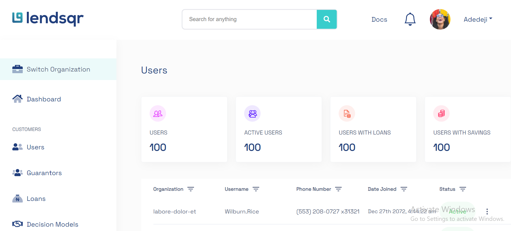
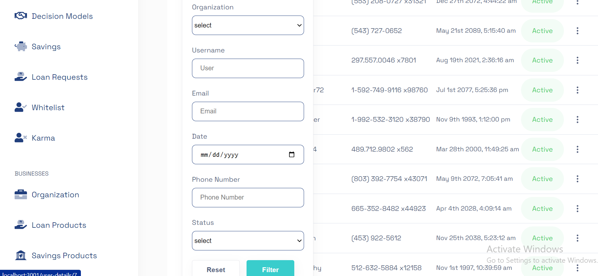
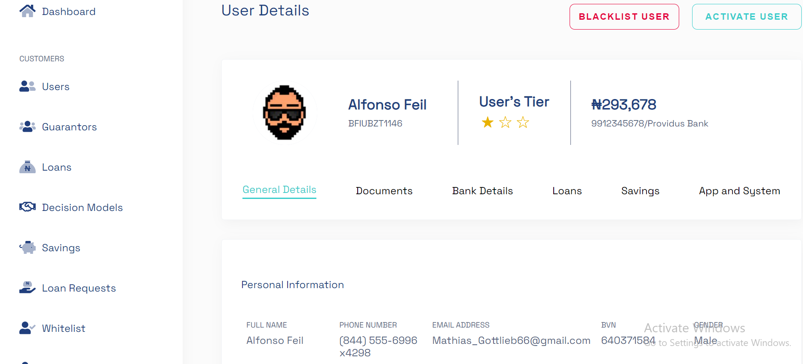

<h1>
lends-preview 👋 
</h1>


<p>
  
  <a href="#" target="_blank">
    
  </a>
</p>

 <br>

> At <b>Lendsqr </b>, many of our lenders use our mobile apps to reach over half a million customers. <br> 

> At this scale, we use <b> React </b> with TypeScript and SCSS as its frontend software development stack which allows us to rapidly ideate and release features rapidly and reliably.

### ✨ [Live Demo]()

## Author

👤 **Vinyl Davyl**

- Website: https://vinyldavyl.netlify.app
- Twitter: [@Vinylchi](https://twitter.com/Vinylchi)

<!-- ## Support is contiguous 

Leave a ⭐️ If this project got you going!
<p>
  <a href="https://www.buymeacoffee.com/VinylDavyl"> </a>
</p>
<br /><br /> -->

## Problem Statement 

<p> This application comprises of the following features: 
<ul>
<li> Build 4 pages </li>
<li> Login, Dashboard, User page, User details page </li>
<li> The user pages should pull data from a mock api with 500 records </li>
<li> Use local storage or indexedDB to store and retrieve user details on the user details page. </li>
<li> The page must be mobile responsive </li>
</ul> <br>


## Getting Started

<p> To download this application, in your terminal clone a copy of this repo and type the following inside the directory </p>

```shell 
$ git clone "https://github.com/Vinyl-Davyl/lendsqr-fe-test" 
```
<p> The type the following code below to install all necessary dependencies. 
</p>

```shell
$ npm install .
```
<br> 

## Running the application 
<p>
 To run the application, open a terminal in your working directory where the files are located, and in the root folder, type the commands below. 
</p>

```shell
$ npm start  
```
<p>
 This would start the react application and open a browser for you to view the web application on localhost. 

</p>

<br> 

## Building the application 
<p>
The npm build is used to build a package. 
This occurs where a <package-folder> is a folder that contains a <b>package.json</b> in its root. <br> 
This is the plumbing command that is called by npm link and npm install.
<br>

To build the application, open a terminal in your working directory, and type the following commands. 
</p>
<br> 

```shell 
$ npm run build 
``` 

### ✨ Project Demo <br><br>
  
<p align="center"></p>

<p align="center"></p>

<p align="center"></p>


### ✨ [Live Demo]()

<br>


## Help

<p>
Reach out to Vinyl
  <ul>
     - Website: https://vinyldavyl.netlify.app
  - Twitter: [@Vinylchi](https://twitter.com/Vinylchi) 
  </ul>
</p>
<br>
 

### Company 
*  <b> Lendsqr </b> 


### Version History

* Version 1.0.0 

<br>

### License
* MIT 
* Apache 

<br>
